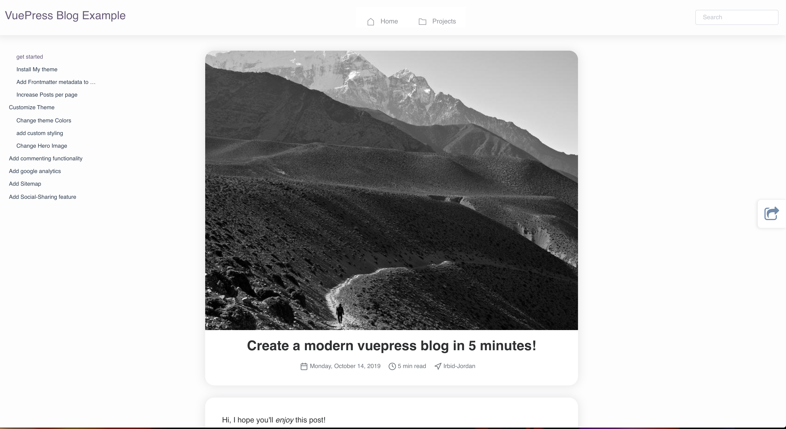

# vuepress-theme-modern-blog

[](https://npmjs.com/package/vuepress-theme-modern-blog) [](https://npmjs.com/package/vuepress-theme-modern-blog)



## Sites

- [Live Example](https://vp-modern.z3by.com/)
- [z3by.com](https://ahmadmostafa.com)
- ??? Your website?

## Install

```bash
yarn add vuepress-theme-modern-blog -D
# OR npm install vuepress-theme-modern-blog -D
```

## Usage

```js
// .vuepress/config.js
module.exports = {
  theme: 'modern-blog',
  themeConfig: {
    // for the full list of options read more in [Docs](./docs/theme-config.md)
  }
}
```

## Contributing

1. Clone this repository.
2. Navigate to the cloned repository `cd vuepress-theme-modern-blog`
3. Run `yarn && yarn dev # Or npm install && npm run dev `
4. Create a new feature.
5. Submit a Pull Request.
